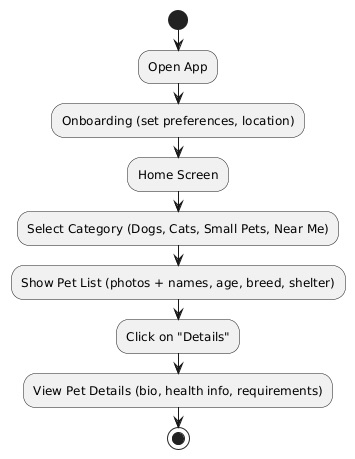
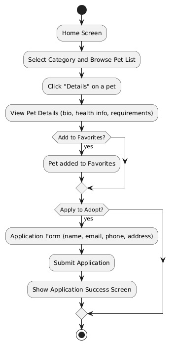
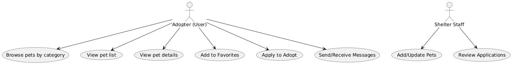
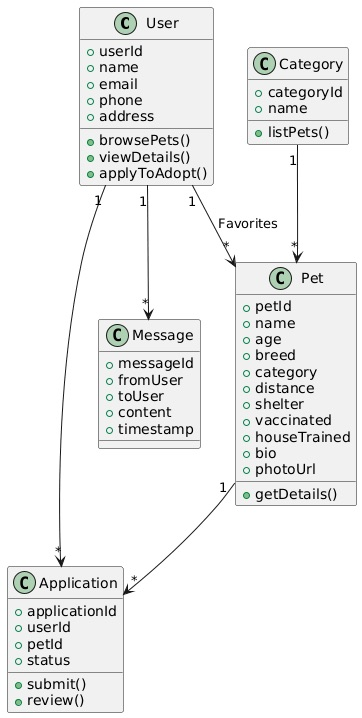

# Specification Phase Exercise

A little exercise to get started with the specification phase of the software development lifecycle. See the [instructions](instructions.md) for more detail.

## Team members

* [Jasmine Zhu](https://github.com/jasminezjr)
* [Esther Feng](https://github.com/yf2685-beep)
* [Eason Huang](https://github.com/GILGAMESH605)
* [Majo Salgado](https://github.com/mariajsalgadoq)
* [Matthew Zhou](https://github.com/mzhou3299)

## Stakeholders

See instructions. Delete this line and replace with the name(s) of the stakeholder(s) you interviewed and lists showing their goals/needs, and problems/frustrations.

## Product Vision Statement

See instructions. Delete this line and place your Product Vision Statement here.

## User Requirements

See instructions. Delete this line and place a list of your User Stories here.

## Activity Diagrams

## Diagrams

### User Story 1  
*As a user, I want to browse pets by category so that I can easily find adoptable animals that match my preferences.*  

---

### User Story 2  
*As a user, I want to apply to adopt a pet by providing my contact information to the shelter so that I can start the adoption process.*  

## Supplementary UML Diagrams

### Use Case Diagram  
Shows the main interactions between adopters and shelter staff.  

---

### Class Diagram  
Shows the system’s main entities and their relationships.  

## Clickable Prototype

See instructions. Delete this line and place a publicly-accessible link to your clickable prototype here.
