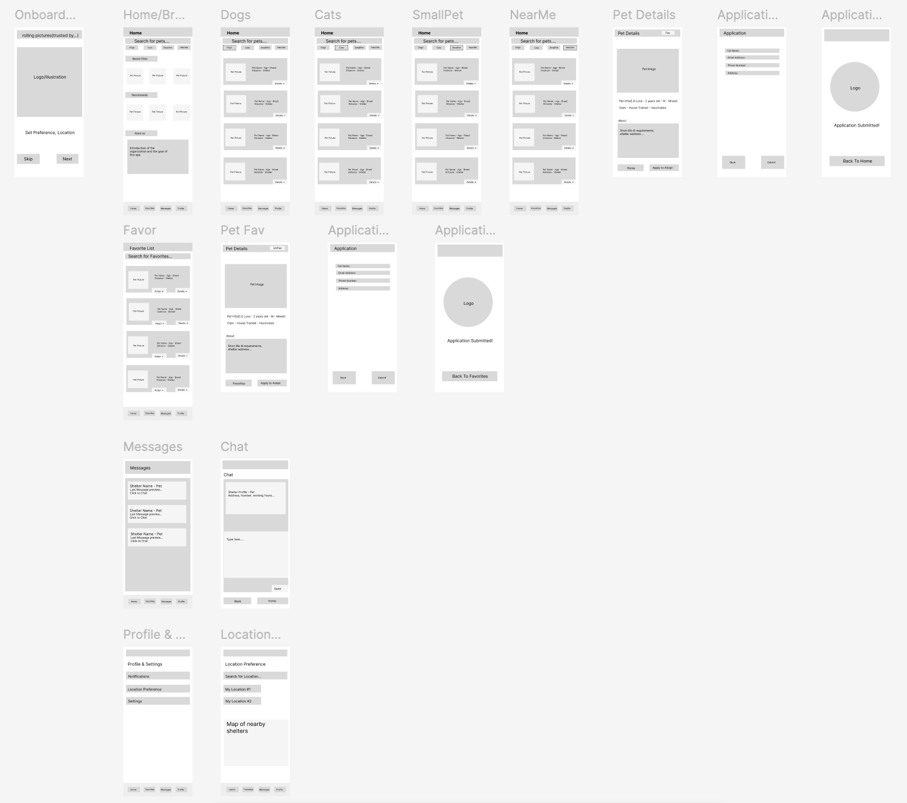

# Specification Phase Exercise

A little exercise to get started with the specification phase of the software development lifecycle. See the [instructions](instructions.md) for more detail.

## Team members

* [Jasmine Zhu](https://github.com/jasminezjr)
* [Esther Feng](https://github.com/yf2685-beep)
* [Eason Huang](https://github.com/GILGAMESH605)
* [Majo Salgado](https://github.com/mariajsalgadoq)
* [Matthew Zhou](https://github.com/mzhou3299)

## Stakeholders

See instructions. Delete this line and replace with the name(s) of the stakeholder(s) you interviewed and lists showing their goals/needs, and problems/frustrations.

## Product Vision Statement

See instructions. Delete this line and place your Product Vision Statement here.

## User Requirements

See instructions. Delete this line and place a list of your User Stories here.

## Activity Diagrams

See instructions. Delete this line and place images of your UML Activity diagrams here.

## Clickable Prototype

The wireframe diagrams outline a user-friendly pet adoption app built around a standard bottom navigation bar (Home, Favorites, Messages, Profile). The core flow allows users to browse pets on the home screen, filter by species, view detailed profiles, and submit an adoption application, culminating in a confirmation screen. The design focuses on clarity and ease of use.

Experience the full user flow and interact with every screen through our [clickable prototype](https://www.figma.com/proto/LVHAVQ2Y52o2i5guBrtj5d/SWE-project-1-wireframe?node-id=4-12&p=f&t=q0jvsskKfnVIZdwh-0&scaling=scale-down&content-scaling=fixed&page-id=0%3A1&starting-point-node-id=4%3A12)

